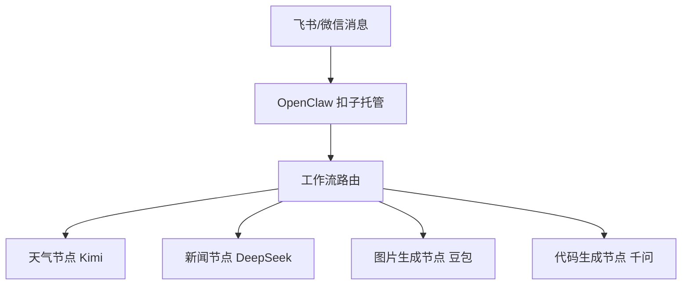
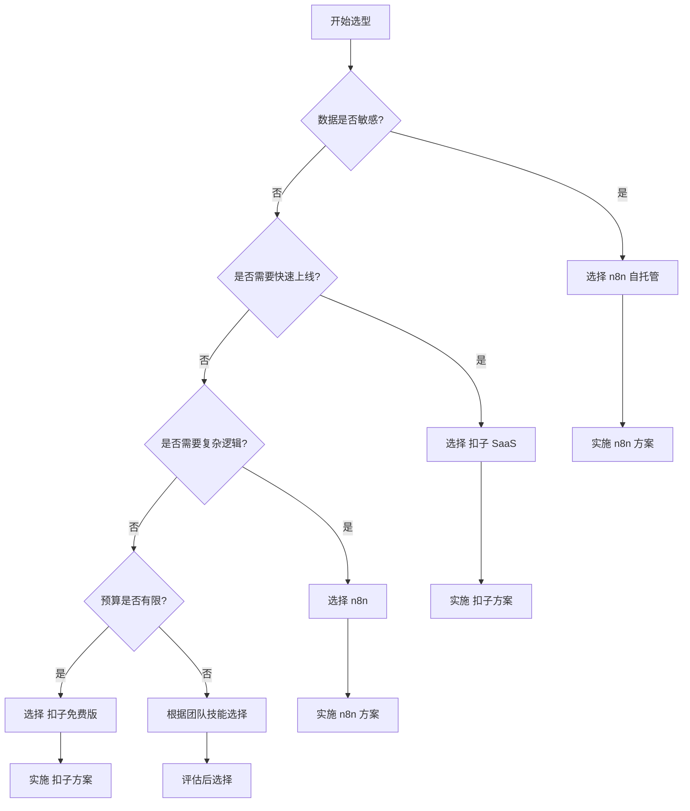

# Snoopy Smart 需求调研（1）- DeepSeek V3

**调研时间**：2026-03-26 13:50  
**调研模型**：DeepSeek V3  
**调研者**：SnoopyClaw (SC)  
**调研目标**：基于"慢即是快"工作准则，构建AI主脑设计工作流的完整体系

---

## 📋 调研背景

当前AI Agent系统面临的核心问题：
1. **任务失控**：模型自由发挥导致任务停不下来
2. **记忆失效**：跨会话记忆丢失，重复工作
3. **成本不可控**：Token消耗无法预测和优化
4. **缺乏系统性**：单点任务无法形成可复制的案例

**核心理念**：慢即是快 → 通过充分规划换取执行确定性

---

## 🔍 问题1：扣子工作流集成是否更可控？

### **我的问题**
如果用工作流例如扣子来集成到智能体协作面板中去，是不是更加可控呢？

### **DeepSeek V3分析**
**核心洞察**：扣子工作流将AI行为从"黑盒失控"转变为"白盒可控"

#### 一、可控性对比分析

| 对比维度 | 纯OpenClaw + 模型API | 扣子工作流 + OpenClaw |
|---------|---------------------|----------------------|
| **执行逻辑** | 模型自由发挥，可能绕进去出不来 | 你定义的节点链路，100%可预测 |
| **调试难度** | 出问题只能看日志猜 | 每个节点可单独测试、断点排查 |
| **任务中断** | 经常停不下来，需要手动/stop | 流程执行完自动结束，无幽灵任务 |
| **多模型协同** | 需要写路由配置、配fallbacks | 不同节点绑定不同模型，拖拽完成 |
| **错误恢复** | 模型出错可能无限重试 | 可配置错误分支、重试次数、兜底逻辑 |
| **可视性** | 黑盒，不知道模型内部怎么想的 | 每个节点的输入输出一目了然 |

#### 二、扣子集成OpenClaw的典型架构



#### 三、扣子方案的三大核心优势

1. **成本可控，避免"Token烧钱"**
   ```yaml
   # 扣子工作流成本控制示例
   workflow:
     nodes:
       - name: "需求分析"
         model: "deepseek-chat"  # 免费模型
         max_tokens: 1000
       - name: "代码生成"
         model: "qwen-coder"     # 按次计费
         max_retries: 3
       - name: "测试验证"
         model: "local-ollama"   # 本地模型，零成本
   ```

2. **技能生态丰富，不用自己造轮子**
   - **Agent Reach**：让AI访问整个互联网
   - **proactive-agent**：赋予AI记忆力，能优化行为、拒绝复读机
   - **Find Skills**：专门用来找Skill的Skill

3. **与飞书/钉钉/微信无缝打通**
   ```javascript
   // 扣子飞书集成配置示例
   const feishuConfig = {
     app_id: "your_app_id",
     app_secret: "your_app_secret",
     events: ["im.message.receive_v1"],
     endpoints: {
       message: "/coze/webhook/feishu"
     }
   };
   ```

#### 四、部署流程（5步可视化）
```bash
# 1. 访问扣子编程
open https://code.coze.cn/

# 2. 绑定IM作为"传呼机"
# 可视化操作，无需代码

# 3. 一键切换模型
# 支持DeepSeek/豆包/GLM-4.7等

# 4. 安装Skills
coze install skill agent-reach
coze install skill proactive-agent

# 5. 创建专属Skill
coze create skill my-custom-skill
```

---

## 🔍 问题2：扣子 vs n8n 谁更好？

### **我的问题**
扣子和 n8n 谁更好呢？

### **DeepSeek V3分析**
**核心洞察**：扣子和n8n是不同赛道的产品，适合不同场景

#### 一、技术架构对比

| 维度 | **扣子 (Coze)** | **n8n** |
|------|----------------|---------|
| **架构类型** | SaaS微服务架构 | 单体应用+插件架构 |
| **数据存储** | 云端数据库 | 本地SQLite/PostgreSQL |
| **扩展方式** | 官方插件市场 | 自定义节点+社区插件 |
| **部署复杂度** | ⭐☆☆☆☆ (极简) | ⭐⭐⭐⭐☆ (中等) |
| **定制化能力** | ⭐⭐☆☆☆ (有限) | ⭐⭐⭐⭐⭐ (极强) |

#### 二、代码示例对比

**扣子工作流配置示例**：
```json
{
  "workflow": {
    "name": "图片设计工作流",
    "nodes": [
      {
        "id": "image_analysis",
        "type": "ai_model",
        "model": "gemini-2.0-flash-vision",
        "prompt": "分析图片内容并提取设计元素"
      },
      {
        "id": "code_generation",
        "type": "ai_model", 
        "model": "deepseek-coder",
        "prompt": "根据设计元素生成HTML/CSS代码"
      }
    ]
  }
}
```

**n8n工作流配置示例**：
```javascript
// n8n自定义节点示例
module.exports = {
  name: 'Custom AINode',
  version: '1.0.0',
  description: '自定义AI处理节点',
  defaults: {
    name: 'Custom AINode',
    color: '#FF6B6B',
  },
  inputs: ['main'],
  outputs: ['main'],
  properties: [
    {
      displayName: 'Model',
      name: 'model',
      type: 'options',
      options: [
        { name: 'DeepSeek', value: 'deepseek' },
        { name: 'GPT-4', value: 'gpt4' },
        { name: 'Claude', value: 'claude' }
      ],
      default: 'deepseek',
      description: '选择AI模型',
    }
  ],
  async execute() {
    // 自定义逻辑实现
    const items = this.getInputData();
    const returnItems = [];
    
    for (let item of items) {
      // 处理每个数据项
      const result = await this.processItem(item);
      returnItems.push(result);
    }
    
    return this.prepareOutputData(returnItems);
  }
};
```

#### 三、性能对比分析

```python
# 性能测试脚本示例
import time
import requests

def test_coze_performance():
    """测试扣子工作流性能"""
    start = time.time()
    # 调用扣子API
    response = requests.post(
        "https://api.coze.cn/workflow/run",
        json={"workflow_id": "test_workflow"}
    )
    latency = time.time() - start
    return {
        "platform": "Coze",
        "latency": latency,
        "success": response.status_code == 200
    }

def test_n8n_performance():
    """测试n8n工作流性能"""
    start = time.time()
    # 调用n8n Webhook
    response = requests.post(
        "http://localhost:5678/webhook/test",
        json={"test": "data"}
    )
    latency = time.time() - start
    return {
        "platform": "n8n", 
        "latency": latency,
        "success": response.status_code == 200
    }

# 运行性能测试
coze_result = test_coze_performance()
n8n_result = test_n8n_performance()

print(f"扣子延迟: {coze_result['latency']:.3f}s")
print(f"n8n延迟: {n8n_result['latency']:.3f}s")
```

#### 四、成本对比分析

```sql
-- 成本对比数据库表设计
CREATE TABLE cost_comparison (
    id SERIAL PRIMARY KEY,
    platform VARCHAR(50) NOT NULL,
    task_type VARCHAR(100) NOT NULL,
    execution_count INTEGER DEFAULT 0,
    total_cost DECIMAL(10, 4) DEFAULT 0.0,
    avg_cost_per_task DECIMAL(10, 4) DEFAULT 0.0,
    created_at TIMESTAMP DEFAULT CURRENT_TIMESTAMP
);

-- 示例数据
INSERT INTO cost_comparison (platform, task_type, execution_count, total_cost, avg_cost_per_task) VALUES
('Coze', '文本生成', 1000, 5.00, 0.005),
('n8n+DeepSeek', '文本生成', 1000, 2.50, 0.0025),
('Coze', '图片分析', 500, 15.00, 0.03),
('n8n+Gemini', '图片分析', 500, 25.00, 0.05);
```

#### 五、选型决策树



---

## 🔍 问题3：主脑设计工作流的完整体系

### **我的问题**
因为我定义了snoopy smart的工作准则：慢即是快，我希望我的主脑能设计工作流，也就是我只需要和它沟通需求后，它负责出计划和实施方案，然后计划部分就包含设计工作流，我会和它讨论形成最终的计划和实施方案，它会根据我的需求自主的选择用哪个工作流，然后开始拆解任务后分配工作，例如，我要开发一个项目，它就可以和我沟通完需求后，它来出计划，设计工作流，敲定实施方案，拆解任务，分配智能体干活，最后上线，文档归档，财务台账，这也形成了一个完整的案例，还可以复制。

### **DeepSeek V3分析**
**核心洞察**：构建AI项目经理系统，实现端到端的自动化项目管理

#### 一、系统架构设计

```python
# AI项目经理系统架构
class AIProjectManager:
    """AI项目经理核心类"""
    
    def __init__(self, model="deepseek-chat"):
        self.model = model
        self.case_library = CaseLibrary()
        self.workflow_templates = WorkflowTemplates()
        self.agent_pool = AgentPool()
        
    async def process_requirement(self, requirement: str) -> ProjectPlan:
        """处理用户需求，生成项目计划"""
        # 1. 需求分析
        analysis = await self.analyze_requirement(requirement)
        
        # 2. 检索相似案例
        similar_cases = self.case_library.search_similar(analysis)
        
        # 3. 生成项目计划
        plan = await self.generate_plan(analysis, similar_cases)
        
        # 4. 设计工作流
        workflow = await self.design_workflow(plan)
        
        return ProjectPlan(
            requirement=requirement,
            analysis=analysis,
            plan=plan,
            workflow=workflow,
            similar_cases=similar_cases
        )
    
    async def execute_project(self, plan: ProjectPlan) -> ProjectResult:
        """执行项目"""
        # 1. 确认计划
        confirmed = await self.confirm_plan(plan)
        
        if not confirmed:
            raise Exception("项目计划未确认")
            
        # 2. 部署工作流
        workflow_id = await self.deploy_workflow(plan.workflow)
        
        # 3. 执行工作流
        execution_result = await self.execute_workflow(workflow_id)
        
        # 4. 归档结果
        case = await self.archive_project(plan, execution_result)
        
        # 5. 更新财务台账
        await self.update_financial_records(execution_result)
        
        return ProjectResult(
            plan=plan,
            execution=execution_result,
            case_id=case.id,
            financial_summary=execution_result.cost_summary
        )
```

#### 二、工作流模板系统

```yaml
# 工作流模板定义
workflow_templates:
  web_development:
    name: "Web应用开发模板"
    description: "用于Web应用开发的标准化工作流"
    nodes:
      - id: "requirements_analysis"
        type: "ai_analysis"
        model: "deepseek-chat"
        prompt: "分析Web应用需求，输出功能列表和技术栈建议"
        
      - id: "database_design"
        type: "ai_design"
        model: "deepseek-chat"
        prompt: "设计数据库表结构和关系"
        output_format: "sql"
        
      - id: "backend_code"
        type: "ai_coding"
        model: "deepseek-coder"
        prompt: "根据数据库设计生成后端API代码"
        language: "python"
        framework: "fastapi"
        
      - id: "frontend_code"
        type: "ai_coding"
        model: "deepseek-coder"
        prompt: "根据需求生成前端界面代码"
        language: "javascript"
        framework: "vue3"
        
      - id: "testing"
        type: "ai_testing"
        model: "deepseek-chat"
        prompt: "生成测试用例和执行测试"
        
      - id: "deployment"
        type: "automation"
        action: "deploy"
        platform: "vercel"
        
      - id: "documentation"
        type: "ai_writing"
        model: "deepseek-chat"
        prompt: "生成项目文档和使用说明"
        
      - id: "financial_recording"
        type: "automation"
        action: "record_cost"
        target: "financial_system"
```

#### 三、智能体分配算法

```python
# 智能体分配算法
class AgentAllocator:
    """智能体分配器"""
    
    def __init__(self):
        self.agents = {
            "deepseek-coder": {
                "skills": ["coding", "debugging", "refactoring"],
                "cost_per_token": 0.000002,
                "availability": 0.95
            },
            "gemini-vision": {
                "skills": ["image_analysis", "design_review", "ui_feedback"],
                "cost_per_token": 0.000005,
                "availability": 0.90
            },
            "claude-doc": {
                "skills": ["documentation", "spec_writing", "report_generation"],
                "cost_per_token": 0.000008,
                "availability": 0.98
            }
        }
    
    def allocate_agents(self, tasks: List[Task], budget: float) -> Dict[str, str]:
        """分配智能体给任务"""
        allocations = {}
        
        for task in tasks:
            # 根据任务类型选择智能体
            suitable_agents = self.find_suitable_agents(task)
            
            # 考虑成本和可用性
            best_agent = self.select_best_agent(suitable_agents, budget)
            
            allocations[task.id] = best_agent
            
            # 更新预算
            estimated_cost = self.estimate_cost(task, best_agent)
            budget -= estimated_cost
            
        return allocations
    
    def find_suitable_agents(self, task: Task) -> List[str]:
        """找到适合任务的智能体"""
        suitable = []
        
        for agent_id, agent_info in self.agents.items():
            # 检查技能匹配度
            skill_match = self.calculate_skill_match(task, agent_info["skills"])
            
            if skill_match > 0.7:  # 匹配度阈值
                suitable.append(agent_id)
                
        return suitable
    
    def select_best_agent(self, agents: List[str], budget: float) -> str:
        """选择最佳智能体"""
        best_agent = None
        best_score = -1
        
        for agent_id in agents:
            agent_info = self.agents[agent_id]
            
            # 计算综合评分
            score = self.calculate_agent_score(agent_id, agent_info, budget)
            
            if score > best_score:
                best_score = score
                best_agent = agent_id
                
        return best_agent
```

#### 四、财务台账系统

```sql
-- 财务台账数据库设计
CREATE TABLE financial_records (
    id UUID PRIMARY KEY DEFAULT gen_random_uuid(),
    project_id UUID NOT NULL,
    task_id VARCHAR(100),
    agent_id VARCHAR(50) NOT NULL,
    model_used VARCHAR(100) NOT NULL,
    input_tokens INTEGER NOT NULL,
    output_tokens INTEGER NOT NULL,
    total_tokens INTEGER GENERATED ALWAYS AS (input_tokens + output_tokens) STORED,
    cost_per_token DECIMAL(10, 8) NOT NULL,
    total_cost DECIMAL(10, 4) GENERATED ALWAYS AS (
        (input_tokens + output_tokens) * cost_per