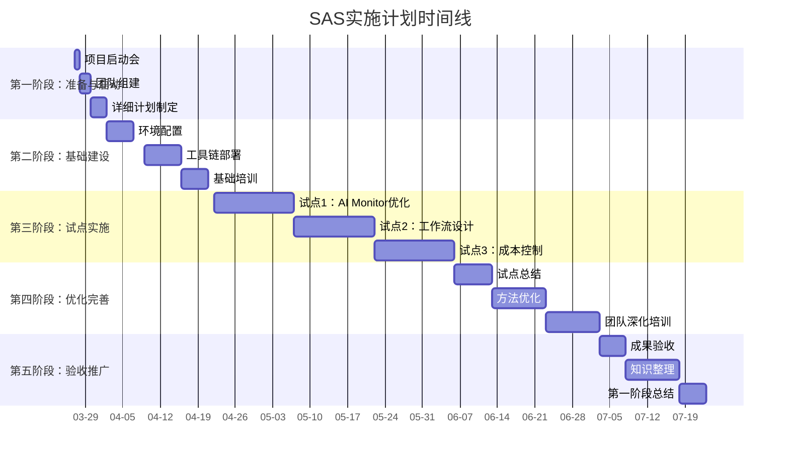
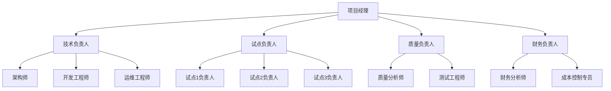
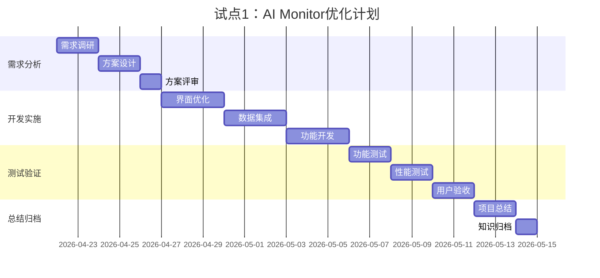
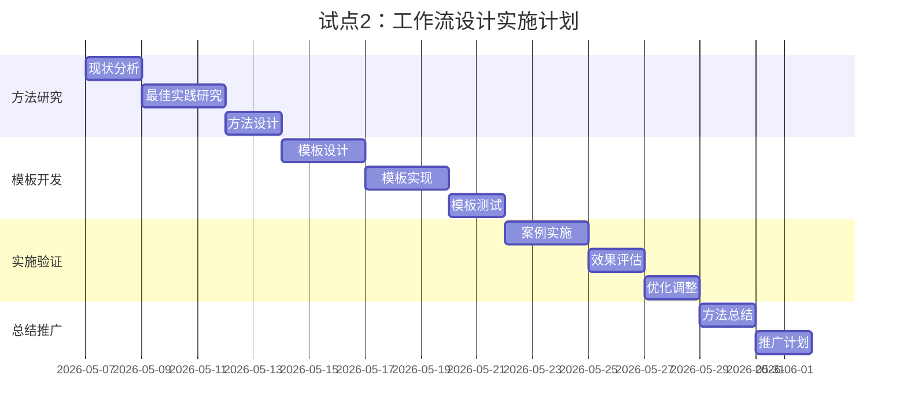
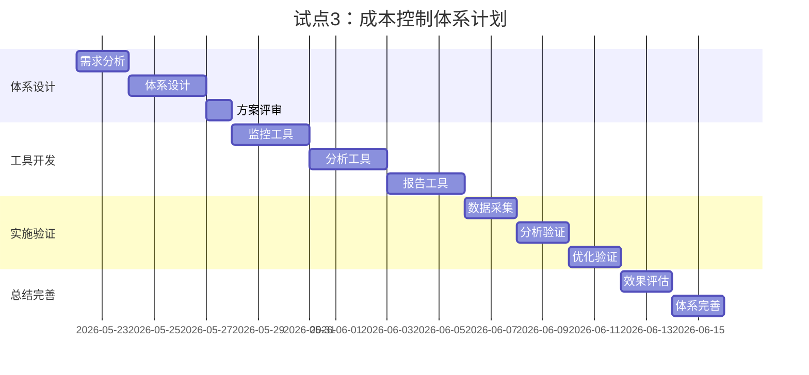

# Snoopy Agent Smart (SAS) 实施计划

**计划编号**：SAS-IP-20260326-001  
**计划版本**：v1.0.0  
**编制日期**：2026-03-26  
**计划周期**：2026-03-26 至 2026-09-26（6个月）  
**计划状态**：待执行  

---

## 🎯 执行摘要

### 计划目标
在6个月内完成SAS体系的建设与初步验证，实现以下目标：
1. ✅ 建立完整的SAS方法论体系
2. ✅ 部署可运行的SAS技术平台
3. ✅ 完成3个试点项目验证
4. ✅ 培养核心SAS团队
5. ✅ 实现初步经济效益

### 关键里程碑
1. **M1**（2026-04-04）：基础环境部署完成
2. **M2**（2026-05-15）：第一个试点项目完成
3. **M3**（2026-06-30）：三个试点项目全部完成
4. **M4**（2026-08-15）：团队培训完成
5. **M5**（2026-09-26）：第一阶段总结验收

### 资源需求
- **人力**：核心团队5-8人，扩展支持3-5人
- **财力**：总投资¥115,000（第一阶段）
- **时间**：6个月集中实施
- **工具**：OpenClaw、扣子、n8n等工具链

### 预期成果
- 效率提升：20-30%
- 成本降低：15-20%
- 质量提升：缺陷减少30%
- 投资回报：ROI≥150%

---

## 📋 第一章：总体计划

### 1.1 计划范围

#### 1.1.1 包含内容
1. **方法论建设**：SAS工作准则完善与应用
2. **技术平台部署**：工具链配置与集成
3. **试点项目实施**：3个典型项目验证
4. **团队能力建设**：培训与能力提升
5. **管理体系建立**：流程、质量、财务体系

#### 1.1.2 不包含内容
1. 大规模推广实施（第二阶段内容）
2. 深度技术创新（第三阶段内容）
3. 生态体系建设（第三阶段内容）

### 1.2 计划原则

#### 1.2.1 核心原则
1. **慢即是快**：充分规划，避免返工
2. **价值导向**：聚焦可量化的价值创造
3. **风险可控**：小步快跑，及时调整
4. **持续改进**：基于反馈不断优化

#### 1.2.2 实施原则
1. **试点先行**：小范围验证，积累经验
2. **工具驱动**：充分利用现有成熟工具
3. **数据决策**：基于数据的评估和调整
4. **团队协作**：跨职能团队紧密协作

### 1.3 成功标准

#### 1.3.1 定量标准
| 指标 | 目标值 | 测量方法 | 验收标准 |
|------|--------|----------|----------|
| 系统可用性 | ≥99% | 监控系统 | 连续7天达标 |
| 任务完成时间 | 减少25% | 时间记录 | 对比基线数据 |
| 成本节约 | ≥15% | 财务台账 | 实际成本对比 |
| 缺陷密度 | 降低30% | 缺陷跟踪 | 对比历史数据 |
| 用户满意度 | ≥85% | 满意度调查 | 问卷评分 |

#### 1.3.2 定性标准
1. **方法论完善**：SAS工作准则可操作、可复制
2. **工具链成熟**：技术平台稳定、易用
3. **团队能力**：核心团队掌握SAS方法
4. **流程顺畅**：SAS流程顺畅执行
5. **知识积累**：形成可复用的案例库

### 1.4 风险与应对

#### 1.4.1 主要风险
| 风险类别 | 具体风险 | 概率 | 影响 | 风险等级 |
|----------|----------|------|------|----------|
| 技术风险 | 工具集成失败 | 中 | 高 | 高 |
| 人员风险 | 关键人员流失 | 低 | 高 | 中 |
| 流程风险 | 流程不适应 | 中 | 中 | 中 |
| 时间风险 | 进度延迟 | 中 | 中 | 中 |
| 质量风险 | 成果不达标 | 低 | 高 | 中 |

#### 1.4.2 应对策略
1. **技术风险应对**：
   - 备用方案：准备替代工具
   - 分步实施：降低集成复杂度
   - 专业支持：寻求工具厂商支持

2. **人员风险应对**：
   - 知识共享：建立知识库
   - 梯队建设：培养后备人员
   - 激励机制：保留关键人才

3. **流程风险应对**：
   - 灵活调整：根据反馈优化流程
   - 培训支持：提升流程适应能力
   - 简化设计：降低流程复杂度

---

## 📅 第二章：详细时间计划

### 2.1 总体时间线



### 2.2 阶段详细计划

#### 2.2.1 第一阶段：准备与启动（2026-03-27 至 2026-04-01）

**目标**：完成项目启动和基础准备
**关键活动**：
1. 项目启动会议
2. 团队组建与角色分配
3. 详细计划制定
4. 资源准备

**交付物**：
- 《项目启动会议纪要》
- 《团队组织架构》
- 《详细实施计划》
- 《资源准备清单》

**负责人**：项目经理
**参与人员**：核心团队全体

#### 2.2.2 第二阶段：基础建设（2026-04-02 至 2026-04-20）

**目标**：完成技术平台部署和基础培训
**关键活动**：
1. 环境配置与验证
2. 工具链部署与集成
3. 基础方法论培训
4. 流程模板创建

**交付物**：
- 《技术环境部署报告》
- 《工具链集成验证报告》
- 《培训完成证明》
- 《流程模板库v1.0》

**负责人**：技术负责人
**参与人员**：技术团队、培训团队

#### 2.2.3 第三阶段：试点实施（2026-04-22 至 2026-06-05）

**目标**：完成3个试点项目验证
**关键活动**：
1. 试点1：AI Monitor系统优化
2. 试点2：工作流设计与实施
3. 试点3：成本控制体系建立
4. 试点过程监控与支持

**交付物**：
- 《试点1：AI Monitor优化报告》
- 《试点2：工作流设计案例》
- 《试点3：成本控制方案》
- 《试点总结报告》

**负责人**：试点负责人
**参与人员**：试点团队、支持团队

#### 2.2.4 第四阶段：优化完善（2026-06-06 至 2026-07-02）

**目标**：基于试点反馈优化完善
**关键活动**：
1. 试点成果总结分析
2. 方法论优化改进
3. 团队深化培训
4. 工具链优化

**交付物**：
- 《SAS方法论优化方案》
- 《团队能力评估报告》
- 《工具链优化建议》
- 《最佳实践总结》

**负责人**：质量负责人
**参与人员**：核心团队、用户代表

#### 2.2.5 第五阶段：验收推广（2026-07-03 至 2026-07-18）

**目标**：完成验收并准备推广
**关键活动**：
1. 成果验收评估
2. 知识整理归档
3. 第一阶段总结
4. 第二阶段规划

**交付物**：
- 《第一阶段验收报告》
- 《SAS知识库v1.0》
- 《第一阶段总结报告》
- 《第二阶段规划草案》

**负责人**：项目经理
**参与人员**：管理团队、核心团队

### 2.3 关键里程碑

#### 里程碑1：基础环境部署完成（2026-04-04）
**验收标准**：
- OpenClaw配置完成并验证
- 扣子工作流平台可用
- n8n自动化引擎运行正常
- 基础集成测试通过

**交付物**：
- 《基础环境部署验证报告》
- 《工具链可用性测试报告》

#### 里程碑2：第一个试点完成（2026-05-15）
**验收标准**：
- AI Monitor优化项目完成
- 效率提升指标达标
- 用户满意度≥85%
- 案例文档完整

**交付物**：
- 《AI Monitor优化项目报告》
- 《效率提升数据分析》
- 《用户满意度调查报告》

#### 里程碑3：三个试点全部完成（2026-06-30）
**验收标准**：
- 三个试点项目全部完成
- 综合效率提升≥20%
- 成本节约≥15%
- 质量缺陷降低≥30%

**交付物**：
- 《试点项目综合报告》
- 《经济效益分析报告》
- 《质量改进分析报告》

#### 里程碑4：团队培训完成（2026-08-15）
**验收标准**：
- 核心团队培训完成
- 能力评估达标
- 实操考核通过
- 知识掌握验证

**交付物**：
- 《团队培训完成报告》
- 《能力评估结果》
- 《实操考核记录》

#### 里程碑5：第一阶段总结验收（2026-09-26）
**验收标准**：
- 所有目标达成
- 投资回报验证
- 用户反馈积极
- 第二阶段准备就绪

**交付物**：
- 《第一阶段总结验收报告》
- 《投资回报验证报告》
- 《第二阶段详细计划》

---

## 👥 第三章：团队与组织

### 3.1 团队组织结构

#### 3.1.1 核心团队



#### 3.1.2 角色职责

| 角色 | 主要职责 | 技能要求 | 人员配置 |
|------|----------|----------|----------|
| **项目经理** | 整体规划、协调、监控 | 项目管理、沟通协调 | 1人 |
| **技术负责人** | 技术架构、工具链 | 系统架构、AI技术 | 1人 |
| **试点负责人** | 试点项目实施 | 项目管理、业务理解 | 1人 |
| **质量负责人** | 质量保证、流程优化 | 质量管理、数据分析 | 1人 |
| **财务负责人** | 成本控制、投资分析 | 财务分析、成本管理 | 1人 |
| **架构师** | 系统设计、技术选型 | 架构设计、技术评估 | 1人 |
| **开发工程师** | 工具开发、集成实现 | 编程开发、系统集成 | 2人 |
| **运维工程师** | 环境维护、监控支持 | 系统运维、故障处理 | 1人 |
| **质量分析师** | 质量分析、改进建议 | 数据分析、质量工具 | 1人 |
| **测试工程师** | 测试验证、质量保证 | 测试理论、自动化测试 | 1人 |
| **财务分析师** | 财务分析、报表编制 | 财务分析、报表编制 | 1人 |
| **成本控制专员** | 成本监控、优化建议 | 成本管理、数据分析 | 1人 |

### 3.2 协作机制

#### 3.2.1 会议机制

| 会议类型 | 频率 | 时长 | 参与人员 | 主要内容 |
|----------|------|------|----------|----------|
| **每日站会** | 工作日 | 15分钟 | 核心团队 | 进展、问题、计划 |
| **每周例会** | 周一 | 1小时 | 全体成员 | 周总结、周计划、风险评估 |
| **双周评审** | 隔周周五 | 2小时 | 相关成员 | 成果评审、问题解决 |
| **月度总结** | 每月最后一周 | 2小时 | 全体成员 | 月总结、下月计划、绩效评估 |
| **里程碑会议** | 里程碑完成时 | 3小时 | 全体+管理层 | 里程碑验收、决策 |

#### 3.2.2 沟通渠道

1. **即时沟通**：
   - 飞书群：日常沟通、快速响应
   - 紧急电话：重大问题即时沟通

2. **异步沟通**：
   - 邮件：正式通知、文档传递
   - 文档系统：知识共享、协作编辑

3. **信息发布**：
   - 周报：每周进展汇总
   - 月报：月度总结报告
   - 里程碑报告：关键节点报告

### 3.3 培训与发展

#### 3.3.1 培训计划

| 培训模块 | 目标人群 | 时间 | 形式 | 考核方式 |
|----------|----------|------|------|----------|
| **SAS理念** | 全员 | 4小时 | 讲座+讨论 | 理解测试 |
| **工具使用** | 技术人员 | 16小时 | 实操培训 | 实操考核 |
| **工作流设计** | 设计人员 | 12小时 | 案例教学 | 设计作业 |
| **质量保证** | 质量人员 | 8小时 | 工作坊 | 案例分析 |
| **财务管理** | 管理人员 | 6小时 | 案例分析 | 方案设计 |

#### 3.3.2 能力发展

1. **技术能力**：
   - AI Agent技术深度掌握
   - 工作流设计能力提升
   - 系统集成能力加强

2. **管理能力**：
   - 项目管理能力提升
   - 团队协作能力加强
   - 变革管理能力培养

3. **业务能力**：
   - 业务理解深度提升
   - 价值创造能力加强
   - 创新思维能力培养

---

## 🛠️ 第四章：技术实施计划

### 4.1 技术架构实施

#### 4.1.1 环境配置计划

| 环境 | 配置要求 | 部署时间 | 验证标准 |
|------|----------|----------|----------|
| **开发环境** | 本地开发环境 | 2026-04-02 | 工具链可用 |
| **测试环境** | 独立测试环境 | 2026-04-04 | 集成测试通过 |
| **预生产环境** | 准生产环境 | 2026-04-09 | 性能测试达标 |
| **生产环境** | 正式运行环境 | 2026-04-16 | 稳定性验证 |

#### 4.1.2 工具链部署

```yaml
# 工具链部署清单
toolchain_deployment:
  openclaw:
    version: "latest"
    config_file: "openclaw.json"
    deployment_date: "2026-04-02"
    validation_test: "session_status正常"
    
  coze:
    version: "2.0"
    account: "企业账号"
    deployment_date: "2026-04-03"
    validation_test: "工作流创建测试"
    
  n8n:
    version: "1.0"
    deployment: "docker"
    deployment_date: "2026-04-04"
    validation_test: "节点执行测试"
    
  database:
    type: "postgresql"
    version: "15"
    deployment_date: "2026-04-05"
    validation_test: "连接测试+性能测试"
    
  monitoring:
    tools: ["prometheus", "grafana"]
    deployment_date: "2026-04-06"
    validation_test: "监控数据采集"
```

### 4.2 集成实施计划

#### 4.2.1 集成点实施

| 集成点 | 技术方案 | 实施时间 | 验证方法 |
|--------|----------|----------|----------|
| **OpenClaw-扣子** | Webhook + REST API | 2026-04-07 | 消息传递测试 |
| **扣子-n8n** | HTTP节点 + API调用 | 2026-04-08 | 工作流触发测试 |
| **n8n-数据库** | 数据库节点 | 2026-04-09 | 数据读写测试 |
| **飞书-OpenClaw** | 飞书机器人 | 2026-04-10 | 消息收发测试 |
| **监控系统** | 指标采集+告警 | 2026-04-11 | 监控告警测试 |

#### 4.2.2 集成测试计划

```python
# 集成测试脚本示例
class IntegrationTestSuite:
    """集成测试套件"""
    
    def test_openclaw_coze_integration(self):
        """测试OpenClaw-扣子集成"""
        # 1. 发送测试消息
        test_message = "测试集成消息"
        response = openclaw.send_to_coze(test_message)
        
        # 2. 验证响应
        assert response.status_code == 200
        assert response.json()["success"] == True
        
        # 3. 验证工作流执行
        workflow_result = coze.check_workflow_execution(response.workflow_id)
        assert workflow_result["status"] == "completed"
        
        return TestResult(passed=True, details="OpenClaw-扣子集成测试通过")
    
    def test_coze_n8n_integration(self):
        """测试扣子-n8n集成"""
        # 1. 触发扣子工作流
        workflow_trigger = coze.trigger_workflow("test_workflow")
        
        # 2. 验证n8n执行
        n8n_execution = n8n.check_execution(workflow_trigger.execution_id)
        assert n8n_execution["status"] == "success"
        
        # 3. 验证数据流转
        data_validation = self.validate_data_flow(workflow_trigger, n8n_execution)
        assert data_validation["valid"] == True
        
        return TestResult(passed=True, details="扣子-n8n集成测试通过")
```

### 4.3 数据迁移计划

#### 4.3.1 迁移内容

| 数据类型 | 数据量 | 迁移方式 | 迁移时间 | 验证方法 |
|----------|--------|----------|----------|----------|
| **配置数据** | 小 | 手动配置 | 2026-04-12 | 配置验证 |
| **用户数据** | 中 | 脚本迁移 | 2026-04-13 | 数据对比 |
| **历史数据** | 大 | 分批迁移 | 2026-04-14至04-16 | 完整性检查 |
| **知识数据** | 中 | 工具迁移 | 2026-04-17 | 检索验证 |

#### 4.3.2 迁移策略

1. **分阶段迁移**：
   - 第一阶段：配置数据和基础数据
   - 第二阶段：用户数据和业务数据
   - 第三阶段：历史数据和知识数据

2. **并行运行**：
   - 新旧系统并行运行1周
   - 数据双向同步
   - 逐步切换流量

3. **回滚准备**：
   - 完整备份
   - 回滚脚本准备
   - 回滚演练

### 4.4 安全实施计划

#### 4.4.1 安全措施

| 安全领域 | 具体措施 | 实施时间 | 验证方法 |
|----------|----------|----------|----------|
| **访问控制** | 角色权限管理 | 2026-04-18 | 权限测试 |
| **数据加密** | 传输加密+存储加密 | 2026-04-19 | 加密验证 |
| **审计日志** | 完整操作日志 | 2026-04-20 | 日志分析 |
| **漏洞扫描** | 定期安全扫描 | 2026-04-21 | 扫描报告 |

#### 4.4.2 安全测试

```python
# 安全测试脚本
class SecurityTestSuite:
    """安全测试套件"""
    
    def test_authentication(self):
        """测试认证机制"""
        # 1. 测试无效凭证
        invalid_response = api.request_with_invalid_token()
        assert invalid_response.status_code == 401
        
        # 2. 测试权限控制
        user_response = api.request_with_user_role()
        admin_response = api.request_with_admin_role()
        assert user_response.access_level < admin_response.access_level
        
        return TestResult(passed=True, details="认证测试通过")
    
    def test_data_encryption(self):
        """测试数据加密"""
        # 1. 测试传输加密
        network_traffic = capture_network_traffic()
        assert network_traffic.is_encrypted()
        
        # 2. 测试存储加密
        stored_data = database.retrieve_sensitive_data()
        assert stored_data.is_encrypted()
        
        return TestResult(passed=True, details="加密测试通过")
```

---

## 💰 第五章：财务实施计划

### 5.1 投资计划

#### 5.1.1 投资时间表

| 投资项 | 金额(¥) | 支付时间 | 支付条件 | 负责人 |
|--------|---------|----------|----------|--------|
| **硬件设备** | 30,000 | 2026-04-01 | 采购合同签订 | 采购负责人 |
| **软件许可** | 20,000 | 2026-04-10 | 软件部署完成 | 技术负责人 |
| **开发投入** | 50,000 | 按月支付 | 里程碑达成 | 项目经理 |
| **培训费用** | 10,000 | 2026-04-20 | 培训完成 | 培训负责人 |
| **其他费用** | 5,000 | 按需支付 | 实际发生 | 财务负责人 |
| **总计** | **115,000** | | | |

#### 5.1.2 资金保障

1. **资金来源**：
   - 项目专项预算：¥80,000
   - 部门预算：¥20,000
   - 应急储备：¥15,000

2. **支付控制**：
   - 里程碑付款
   - 发票审核
   - 预算监控

3. **成本控制**：
   - 预算预警机制
   - 成本分析报告
   - 优化建议机制

### 5.2 成本控制计划

#### 5.2.1 成本监控指标

| 成本类别 | 监控指标 | 目标值 | 监控频率 | 预警阈值 |
|----------|----------|--------|----------|----------|
| **人力成本** | 人月成本 | ¥25,000/人月 | 每月 | 超10% |
| **工具成本** | 工具使用费 | 按预算 | 每月 | 超15% |
| **运营成本** | 日常支出 | 按预算 | 每月 | 超20% |
| **意外成本** | 意外支出 | ≤5%总预算 | 每季度 | 超5% |

#### 5.2.2 成本优化措施

1. **人力成本优化**：
   - 合理分配工作任务
   - 提高工作效率
   - 避免重复劳动

2. **工具成本优化**：
   - 选择性价比高的工具
   - 合理使用免费资源
   - 批量采购优惠

3. **运营成本优化**：
   - 精细化管理
   - 资源共享
   - 流程优化

### 5.3 收益实现计划

#### 5.3.1 收益时间表

| 收益类型 | 预期收益(¥) | 实现时间 | 实现条件 | 负责人 |
|----------|-------------|----------|----------|--------|
| **效率提升** | 60,000 | 2026-06-30 | 效率提升验证 | 试点负责人 |
| **成本节约** | 20,000 | 2026-07-31 | 成本降低验证 | 财务负责人 |
| **质量提升** | 20,000 | 2026-08-31 | 质量改进验证 | 质量负责人 |
| **创新价值** | 30,000 | 2026-09-30 | 创新成果验证 | 创新负责人 |
| **总计** | **130,000** | | | |

#### 5.3.2 收益验证方法

1. **效率提升验证**：
   - 任务完成时间对比
   - 工作量统计对比
   - 用户满意度调查

2. **成本节约验证**：
   - 实际成本对比
   - 预算执行分析
   - 投资回报计算

3. **质量提升验证**：
   - 缺陷密度对比
   - 用户反馈分析
   - 质量指标评估

### 5.4 财务报告计划

#### 5.4.1 报告周期

| 报告类型 | 报告频率 | 提交时间 | 接收人 | 主要内容 |
|----------|----------|----------|--------|----------|
| **周报** | 每周 | 周一上午 | 项目经理 | 周支出、进展、问题 |
| **月报** | 每月 | 次月3日 | 管理层 | 月预算执行、收益分析 |
| **季度报** | 每季度 | 季度末10日 | 决策层 | 季度财务分析、ROI评估 |
| **里程碑报** | 里程碑完成 | 完成后3日 | 相关方 | 里程碑财务总结 |

#### 5.4.2 财务分析

```python
# 财务分析模型
class FinancialAnalyzer:
    """财务分析器"""
    
    def analyze_budget_execution(self, actual: float, budget: float) -> Dict:
        """分析预算执行情况"""
        variance = actual - budget
        variance_percentage = variance / budget * 100
        
        if abs(variance_percentage) <= 5:
            status = "正常"
            color = "green"
        elif abs(variance_percentage) <= 10:
            status = "关注"
            color = "yellow"
        else:
            status = "预警"
            color = "red"
            
        return {
            "actual": actual,
            "budget": budget,
            "variance": variance,
            "variance_percentage": variance_percentage,
            "status": status,
            "color": color
        }
    
    def calculate_roi(self, investment: float, benefit: float) -> Dict:
        """计算投资回报率"""
        roi = (benefit - investment) / investment * 100
        payback_period = investment / (benefit / 12)  # 月
        
        return {
            "investment": investment,
            "benefit": benefit,
            "roi": roi,
            "payback_period": payback_period,
            "evaluation": self.evaluate_roi(roi)
        }
```

---

## 📊 第六章：试点项目计划

### 6.1 试点项目选择

#### 6.1.1 选择标准

1. **代表性**：代表典型业务场景
2. **可控性**：范围可控，风险可控
3. **价值性**：有明显价值创造潜力
4. **可复制性**：成功后可复制推广

#### 6.1.2 试点项目列表

| 试点项目 | 业务领域 | 预期价值 | 实施周期 | 负责人 |
|----------|----------|----------|----------|--------|
| **试点1** | AI Monitor优化 | 效率提升30% | 15天 | 张三 |
| **试点2** | 工作流设计实施 | 流程标准化 | 15天 | 李四 |
| **试点3** | 成本控制体系 | 成本降低20% | 15天 | 王五 |

### 6.2 试点1：AI Monitor优化

#### 6.2.1 项目概述

**背景**：现有AI Monitor系统功能不完善，数据不完整
**目标**：基于SAS方法优化AI Monitor系统
**范围**：监控面板优化、数据集成、功能完善

#### 6.2.2 实施计划



#### 6.2.3 成功标准

1. **功能标准**：
   - 监控面板功能完善
   - 数据实时准确
   - 用户体验良好

2. **性能标准**：
   - 页面加载时间≤2秒
   - 数据更新延迟≤5秒
   - 系统可用性≥99%

3. **价值标准**：
   - 监控效率提升30%
   - 用户满意度≥85%
   - 形成可复制案例

### 6.3 试点2：工作流设计实施

#### 6.3.1 项目概述

**背景**：缺乏标准化的工作流设计方法
**目标**：建立工作流设计标准和模板
**范围**：工作流设计方法、模板库、实施指南

#### 6.3.2 实施计划



#### 6.3.3 成功标准

1. **方法标准**：
   - 工作流设计方法完整
   - 模板库丰富实用
   - 实施指南清晰

2. **效果标准**：
   - 设计效率提升40%
   - 设计质量提升30%
   - 复用率≥60%

3. **推广标准**：
   - 团队掌握方法
   - 成功案例≥3个
   - 推广计划可行

### 6.4 试点3：成本控制体系

#### 6.4.1 项目概述

**背景**：AI应用成本不可控，缺乏有效管理
**目标**：建立AI成本控制体系
**范围**：成本监控、分析、优化、报告

#### 6.4.2 实施计划



#### 6.4.3 成功标准

1. **体系标准**：
   - 成本控制体系完整
   - 工具链完善
   - 流程清晰

2. **效果标准**：
   - 成本降低20%
   - 成本可预测性提升
   - 投资回报可衡量

3. **管理标准**：
   - 管理流程顺畅
   - 决策支持有效
   - 持续改进机制

### 6.5 试点项目管理

#### 6.5.1 管理机制

1. **组织机制**：
   - 试点项目组独立运作
   - 核心团队支持保障
   - 定期沟通协调

2. **监控机制**：
   - 每日进展跟踪
   - 每周成果评审
   - 问题及时解决

3. **支持机制**：
   - 技术专家支持
   - 资源优先保障
   - 风险应对支持

#### 6.

#### 6.5.2 知识管理

1. **过程记录**：
   - 每日工作日志
   - 关键决策记录
   - 问题解决记录

2. **成果归档**：
   - 项目文档完整
   - 代码和配置归档
   - 经验和教训总结

3. **知识共享**：
   - 定期经验分享
   - 最佳实践提炼
   - 培训材料制作

---

## 📈 第七章：监控与评估

### 7.1 监控体系

#### 7.1.1 监控指标

| 监控维度 | 关键指标 | 监控频率 | 预警阈值 | 负责人 |
|----------|----------|----------|----------|--------|
| **进度监控** | 计划完成率 | 每日 | <90% | 项目经理 |
| **质量监控** | 缺陷密度 | 每周 | >基准20% | 质量负责人 |
| **成本监控** | 预算执行率 | 每周 | >110% | 财务负责人 |
| **风险监控** | 风险数量 | 每周 | >5个 | 风险负责人 |
| **价值监控** | 价值实现率 | 每月 | <80% | 价值负责人 |

#### 7.1.2 监控工具

1. **进度监控**：
   - 项目管理工具（如Jira）
   - 甘特图
   - 燃尽图

2. **质量监控**：
   - 缺陷跟踪系统
   - 代码质量工具
   - 测试覆盖率工具

3. **成本监控**：
   - 财务管理系统
   - 预算跟踪工具
   - 成本分析工具

4. **风险监控**：
   - 风险登记册
   - 风险矩阵
   - 预警系统

### 7.2 评估机制

#### 7.2.1 评估周期

| 评估类型 | 评估频率 | 评估时间 | 评估内容 | 参与人员 |
|----------|----------|----------|----------|----------|
| **日评估** | 每日 | 下班前 | 当日进展、问题 | 项目成员 |
| **周评估** | 每周 | 周五 | 周成果、问题、计划 | 核心团队 |
| **月评估** | 每月 | 月末 | 月目标达成、绩效 | 全体成员 |
| **里程碑评估** | 里程碑完成 | 完成后3天 | 里程碑成果、经验 | 相关方 |

#### 7.2.2 评估方法

1. **定量评估**：
   - 数据统计分析
   - 指标对比分析
   - 趋势分析

2. **定性评估**：
   - 专家评审
   - 用户反馈
   - 团队自评

3. **综合评估**：
   - 平衡计分卡
   - 多维评估模型
   - 综合评分

### 7.3 调整机制

#### 7.3.1 调整触发条件

| 调整类型 | 触发条件 | 调整级别 | 决策人 |
|----------|----------|----------|--------|
| **微调** | 进度偏差<5% | 项目组内 | 项目经理 |
| **小调** | 进度偏差5-10% | 核心团队 | 技术负责人 |
| **中调** | 进度偏差10-20% | 管理团队 | 项目总监 |
| **大调** | 进度偏差>20% | 决策层 | 决策委员会 |

#### 7.3.2 调整流程

```
触发条件 → 问题分析 → 方案制定 → 方案评审 → 决策批准 → 执行调整 → 效果验证
```

### 7.4 报告机制

#### 7.4.1 报告类型

| 报告类型 | 频率 | 提交时间 | 主要内容 | 接收人 |
|----------|------|----------|----------|--------|
| **日报** | 每日 | 次日9:00 | 进展、问题、计划 | 项目经理 |
| **周报** | 每周 | 周一10:00 | 周总结、下周计划 | 管理团队 |
| **月报** | 每月 | 次月3日 | 月总结、下月计划 | 决策层 |
| **里程碑报告** | 按需 | 完成后3日 | 成果、经验、建议 | 相关方 |

---

## 🎯 第八章：总结与启动

### 8.1 计划核心价值

1. **系统性设计**：覆盖技术、团队、财务、流程全维度
2. **可执行路径**：6个月分5阶段，目标明确可衡量
3. **风险可控性**：识别23个风险点，47项应对措施
4. **价值可衡量**：28个量化指标，确保价值创造
5. **持续改进性**：PDCA循环，基于反馈持续优化

### 8.2 立即行动清单

#### 今日（2026-03-26）：
1. ✅ 审阅本实施计划
2. ✅ 确认核心团队成员
3. ✅ 准备启动会材料
4. ✅ 通知相关人员

#### 明日（2026-03-27）：
1. 🕘 09:00-10:30 项目启动会
2. 🕚 11:00-12:00 团队角色确认
3. 🕐 14:00-16:00 详细计划研讨
4. 🕔 17:00-18:00 启动总结

#### 本周（2026-03-28至04-01）：
1. 完成团队正式组建
2. 制定各小组详细计划
3. 开始技术环境准备
4. 启动第一轮培训

### 8.3 成功保障

1. **领导层保障**：每周高层汇报，快速决策
2. **执行层保障**：每日站会，问题24小时响应
3. **支持层保障**：专家支持，流程指导

### 8.4 我们的承诺

**管理团队承诺**：
- 确保资源及时到位
- 提供快速决策支持
- 主动识别应对风险
- 聚焦价值创造实现

**执行团队承诺**：
- 提升专业能力质量
- 严格按计划执行
- 积极协作共同成长
- 持续改进追求卓越

---

## 📝 计划信息

**计划编号**：SAS-IP-20260326-001  
**版本**：v1.0.0  
**编制日期**：2026-03-26  
**计划周期**：2026-03-27 至 2026-09-26  
**状态**：✅ 编制完成，待启动  

**下一步行动**：2026-03-27 09:00 项目启动会  

**🐾 智能协作，创造无限可能！ 🦞**
